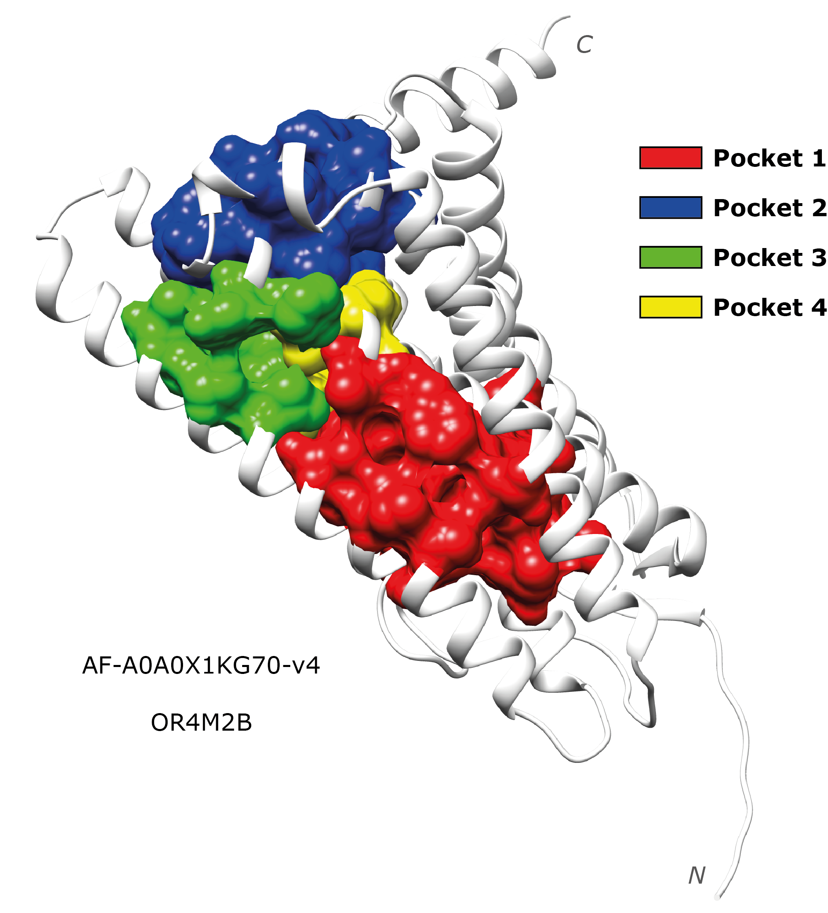

# P2RANK to Chimera 

This repository is to generate Chimera [1] sessions to visualise the results of the ligand binding site prediction software [P2RANK](https://prankweb.cz/) [2-4]. The figure below is a representation of the Chimera session obtained from the P2RANK predictions of the [AlphaFold](https://alphafold.ebi.ac.uk/) [5-7] [model](https://alphafold.ebi.ac.uk/entry/A0A0X1KG70) of the human olfactory receptor 4M2, OR4M2B, ([A0A0X1KG70](https://www.uniprot.org/uniprotkb/A0A0X1KG70/entry)).

Refer to the [P2RANK_TO_CHIMERA.ipynb](https://github.com/JavierSanchez-Utges/P2RANK_to_Chimera/blob/master/P2RANK_TO_CHIMERA.ipynb) notebook to run the code.

## Dependencies

Dependencies for this are Pandas and [UCSF Chimera](https://www.cgl.ucsf.edu/chimera/). In order to obtain P2RANK output, of course, it must be installed. P2RANK is also accessible in a [web server](https://prankweb.cz/). Note that the notebook works with the output for the standalone command line program.

## References
1. Pettersen EF, Goddard TD, Huang CC, Couch GS, Greenblatt DM, Meng EC, Ferrin TE. UCSF Chimera--a visualization system for exploratory research and analysis. J Comput Chem. 2004 Oct;25(13):1605-12. doi: [10.1002/jcc.20084](https://onlinelibrary.wiley.com/doi/10.1002/jcc.20084). PMID: 15264254.
2. Jakubec D, Skoda P, Krivak R, Novotny M, Hoksza D. PrankWeb 3: accelerated ligand-binding site predictions for experimental and modelled protein structures. Nucleic Acids Res. 2022 Jul 5;50(W1):W593-W597. doi: [10.1093/nar/gkac389](https://doi.org/10.1093/nar/gkac389). PMID: 35609995; PMCID: PMC10353840.
3. Jendele L, Krivak R, Skoda P, Novotny M, Hoksza D. PrankWeb: a web server for ligand binding site prediction and visualization. Nucleic Acids Res. 2019 Jul 2;47(W1):W345-W349. doi: [10.1093/nar/gkz424](https://doi.org/10.1093/nar/gkz424). PMID: 31114880; PMCID: PMC6602436.
4. Krivák, R., Hoksza, D. P2Rank: machine learning based tool for rapid and accurate prediction of ligand binding sites from protein structure. J Cheminform 10, 39 (2018). https://doi.org/10.1186/s13321-018-0285-8
5. Jumper, J., Evans, R., Pritzel, A. et al. Highly accurate protein structure prediction with AlphaFold. Nature 596, 583–589 (2021). https://doi.org/10.1038/s41586-021-03819-2
6. Tunyasuvunakool, K., Adler, J., Wu, Z. et al. Highly accurate protein structure prediction for the human proteome. Nature 596, 590–596 (2021). https://doi.org/10.1038/s41586-021-03828-1
7. Mihaly Varadi, Stephen Anyango, Mandar Deshpande, Sreenath Nair, Cindy Natassia, Galabina Yordanova, David Yuan, Oana Stroe, Gemma Wood, Agata Laydon, Augustin Žídek, Tim Green, Kathryn Tunyasuvunakool, Stig Petersen, John Jumper, Ellen Clancy, Richard Green, Ankur Vora, Mira Lutfi, Michael Figurnov, Andrew Cowie, Nicole Hobbs, Pushmeet Kohli, Gerard Kleywegt, Ewan Birney, Demis Hassabis, Sameer Velankar. AlphaFold Protein Structure Database: massively expanding the structural coverage of protein-sequence space with high-accuracy models, Nucleic Acids Research, Volume 50, Issue D1, 7 January 2022, Pages D439–D444, https://doi.org/10.1093/nar/gkab1061
